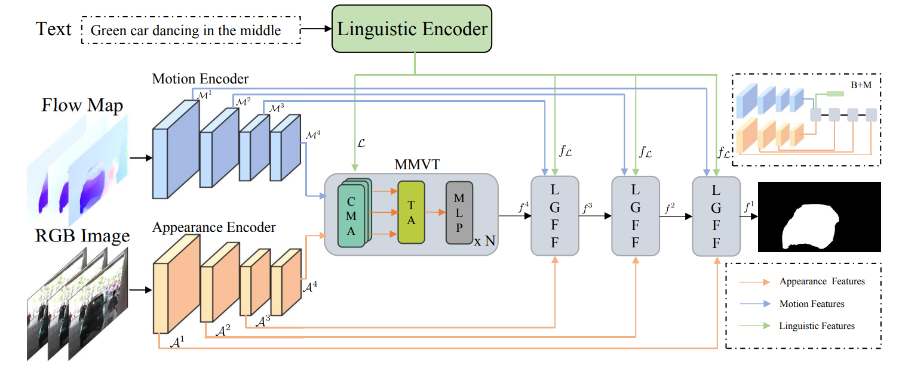

🔥🔥🔥Update 2023.02.19🔥🔥🔥

# 2022CVPR-Modeling-Motion-with-Multi-Modal-Features-for-Text-Based-Video-Segmentation
This is the code for CVPR2022 paper ["Modeling Motion with Multi-Modal Features for Text-Based Video Segmentation"](https://openaccess.thecvf.com/content/CVPR2022/papers/Zhao_Modeling_Motion_With_Multi-Modal_Features_for_Text-Based_Video_Segmentation_CVPR_2022_paper.pdf)


## Framework


## Usage
1. Download [A2D-Sentences](https://kgavrilyuk.github.io/publication/actor_action/) and [JHMDB-Sentences](https://kgavrilyuk.github.io/publication/actor_action/). Then, please convert the raw data into image frames.

2. Please use [RAFT](https://github.com/princeton-vl/RAFT) to generate the opticla flow map (visualize in RGB format) from frame t to frame t+1. Since there are only a few frames annotated in A2D and JHMDB, we only need to generate optical flow maps for these frames. 

3. Put them as follows:
```
your dataset dir/
└── A2D/ 
    ├── allframes/  
    ├── allframes_flow/
    ├── Annotations_visualize
    ├── a2d_txt
        └──train.txt
        └──test.txt
└── J-HMDB/ 
    ├── allframes/  
    ├── allframes_flow/
    ├── Annotations_visualize
    ├── jhmdb_txt
        └──train.txt
        └──test.txt
```
"Annotations_visualize" contains the GT masks for each target object. We have upload them to [BaiduPan](https://pan.baidu.com/s/1pvQP75bHjYfRYZFoCVqpkQ?pwd=lo50)(lo50) for convenience.

4. Download pretrained ResNet-101 and [BETR](https://huggingface.co/bert-base-uncased).
5. We provide the pretrained checkpoint [B+M+T+L+A](https://pan.baidu.com/s/1EHi3rrnmSg8LzTWUtZ2cEw)(u5hx)
 
## Citation
Please consider to cite our work in your publications if you are interest in our research:
```
@inproceedings{zhao2022modeling,
  title={Modeling Motion with Multi-Modal Features for Text-Based Video Segmentation},
  author={Zhao, Wangbo and Wang, Kai and Chu, Xiangxiang and Xue, Fuzhao and Wang, Xinchao and You, Yang},
  booktitle={Proceedings of the IEEE/CVF Conference on Computer Vision and Pattern Recognition},
  pages={11737--11746},
  year={2022}
}
```
